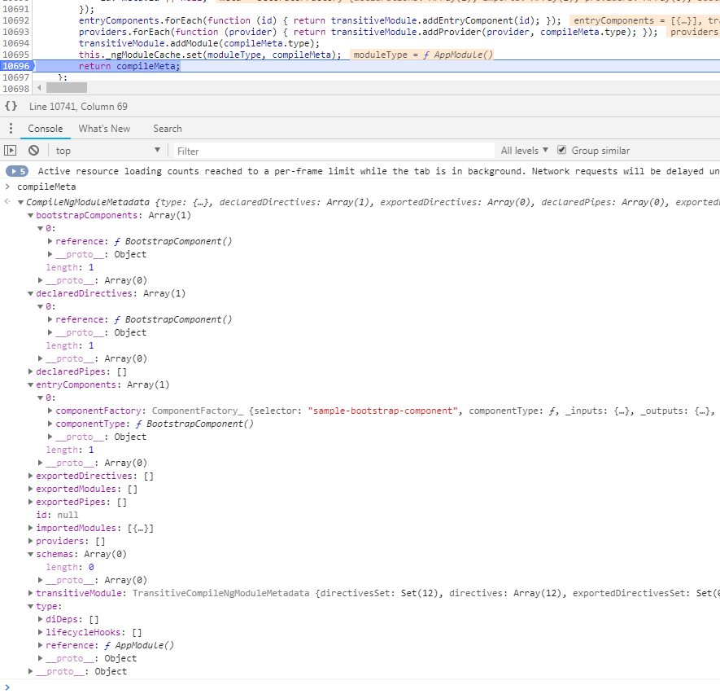
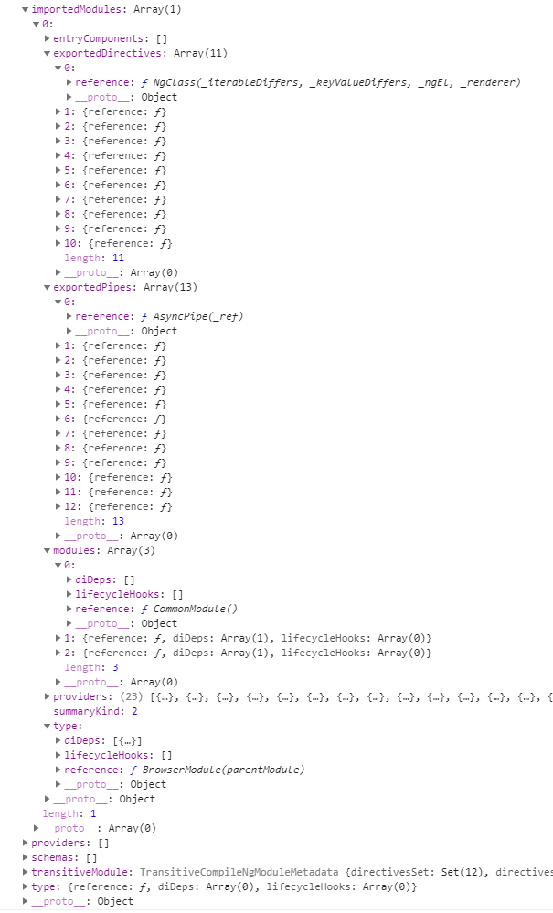
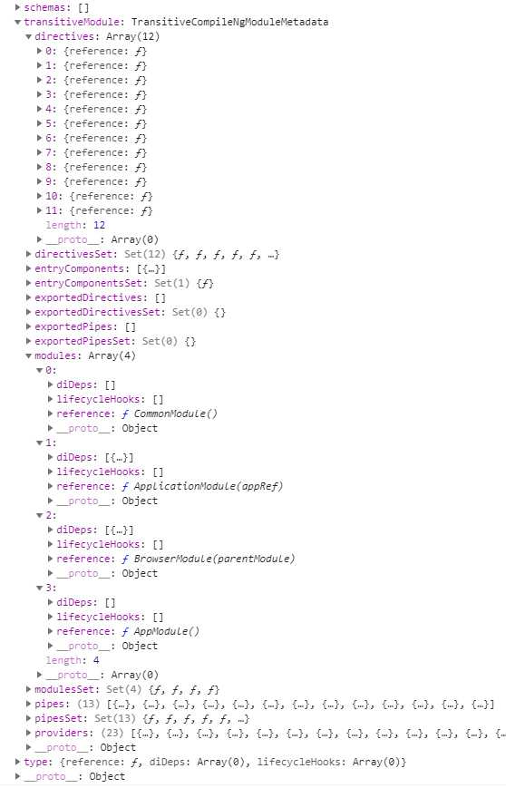

# 引导启动

基础示例代码：

```ts
import { PlatformRef, NgModuleRef } from '@angular/core';
import { platformBrowserDynamic } from '@angular/platform-browser-dynamic';

import { AppModule } from './app/app.module';

const platformRef: PlatformRef = platformBrowserDynamic();
const bootstrap: Promise<NgModuleRef<AppModule>> = platformRef.bootstrapModule(AppModule);

bootstrap
  .then(info => console.log('bootstrap completed...', info))
  .catch(err => console.log(err));
```

## 创建 Angular platform

一个Angular platform是页面上Angular应用的入口点。
每个网页仅有一个platform与若干服务（如反射），它们对于页面上所有的Angular应用来说是公用的。

### Platform factory

`platform`是由`platform factory`所创建。
在加载Angular代码库的过程中，有如下的`platform factory`会被创建：

```txt
Platform: core
|
|--Platform: coreDynamic
|  |--Platform: browserDynamic
|
|--Platform: browser
```

注意，它是一种有继承的树形结构。

其中，`Platform: core`为根。
它是所有其它`platform`的父亲。
它必然被包含进其它的`platform`中。

在创建这些平台工厂的过程中，一些内置的`providers`会被收集起来：

```ts
// Platform: core
const _CORE_PLATFORM_PROVIDERS: StaticProvider[] = [
  // Set a default platform name for platforms that don't set it explicitly.
  {provide: PLATFORM_ID, useValue: 'unknown'},
  {provide: PlatformRef, deps: [Injector]},
  {provide: TestabilityRegistry, deps: []},
  {provide: Console, deps: []},
];
const platformCore = createPlatformFactory(null, 'core', _CORE_PLATFORM_PROVIDERS);

// Platform: coreDynamic
const platformCoreDynamic = createPlatformFactory(platformCore, 'coreDynamic', [
  {provide: COMPILER_OPTIONS, useValue: {}, multi: true},
  {provide: CompilerFactory, useClass: JitCompilerFactory, deps: [COMPILER_OPTIONS]},
]);

// Platform: browserDynamic
const INTERNAL_BROWSER_PLATFORM_PROVIDERS: StaticProvider[] = [
  {provide: PLATFORM_ID, useValue: PLATFORM_BROWSER_ID},
  {provide: PLATFORM_INITIALIZER, useValue: initDomAdapter, multi: true},
  {provide: PlatformLocation, useClass: BrowserPlatformLocation, deps: [DOCUMENT]},
  {provide: DOCUMENT, useFactory: _document, deps: []},
];
const INTERNAL_BROWSER_DYNAMIC_PLATFORM_PROVIDERS: StaticProvider[] = [
  INTERNAL_BROWSER_PLATFORM_PROVIDERS,
  {
    provide: COMPILER_OPTIONS,
    useValue: {providers: [{provide: ResourceLoader, useClass: ResourceLoaderImpl, deps: []}]},
    multi: true
  },
  {provide: PLATFORM_ID, useValue: PLATFORM_BROWSER_ID},
];
const platformBrowserDynamic = createPlatformFactory(
    platformCoreDynamic, 'browserDynamic', INTERNAL_BROWSER_DYNAMIC_PLATFORM_PROVIDERS);
```

### 使用 platform factory 创建 platform

在使用`platform factory`创建`platform`时，`platform`会被自动初始化。
或者你还可以显式地调用`createPlatform`函数。

```ts
const platformRef: PlatformRef = platformBrowserDynamic();
```

上面的代码使用`Platform: browserDynamic`工厂创建一个`platform`。
它会向上遍历直到`Platform: core`，其间收集所有的`providers`。
最终，调用`function createPlatform(injector: Injector): PlatformRef`函数创建一个`platform`。

这时，会创建一个注入器`injector`，并传给`createPlatform()`函数。

## 使用 platform 去引导 Angular 模块

```ts
const bootstrap: Promise<NgModuleRef<AppModule>> = platformRef.bootstrapModule(AppModule);
```

这里我们使用的是*Just-in-Time*方式编译，而不是预编译*Ahead-of-Time*。
因此Angular会首先创建一个*JIT Compiler*。

然后，用创建的编译器去编译`AppModule`模块：

```ts
class JitCompiler {
  // `moduleType` is function `AppModule`
  private _compileModuleAndComponents(moduleType: Type, isSync: boolean): SyncAsync<object> {
    return SyncAsync.then(this._loadModules(moduleType, isSync), () => {
      this._compileComponents(moduleType, null);
      return this._compileModule(moduleType);
    });
  }
}
```

### 加载模块的 compile metadata

在这个阶段，Angular开始加载编译时所需的所有模块的元数据。
`getNgModuleMetadata(mainModule)`将返回`CompileNgModuleMetadata`的实例。
这个对象将用来编译Angular模块。

如果是*Just-in-Time*模式，Angular还会加载所有嵌套的模块，指令以及管道的编译元数据。

```ts
class JitCompiler {
  // https://github.com/angular/angular/blob/master/packages/compiler/src/jit/compiler.ts#L125
  private _loadModules(mainModule: any, isSync: boolean): SyncAsync<any> {
    const loading: Promise<any>[] = [];
    const mainNgModule = this._metadataResolver.getNgModuleMetadata(mainModule) !;
    // Note: for runtime compilation, we want to transitively compile all modules,
    // so we also need to load the declared directives / pipes for all nested modules.
    this._filterJitIdentifiers(mainNgModule.transitiveModule.modules).forEach((nestedNgModule) => {
      // getNgModuleMetadata only returns null if the value passed in is not an NgModule
      const moduleMeta = this._metadataResolver.getNgModuleMetadata(nestedNgModule) !;
      this._filterJitIdentifiers(moduleMeta.declaredDirectives).forEach((ref) => {
        const promise =
            this._metadataResolver.loadDirectiveMetadata(moduleMeta.type.reference, ref, isSync);
        if (promise) {
          loading.push(promise);
        }
      });
      this._filterJitIdentifiers(moduleMeta.declaredPipes)
          .forEach((ref) => this._metadataResolver.getOrLoadPipeMetadata(ref));
    });
    return SyncAsync.all(loading);
  }
}
```







### 编译组件

这一步，挑选出所有的普通组件（如`AppComponent`），以及`entryComponents`里声明的组件。
解析它们的模版和样式。

### 编译模块

编译`AppModule`，并得到一个`ngModuleFactory`。

### 引导模块

